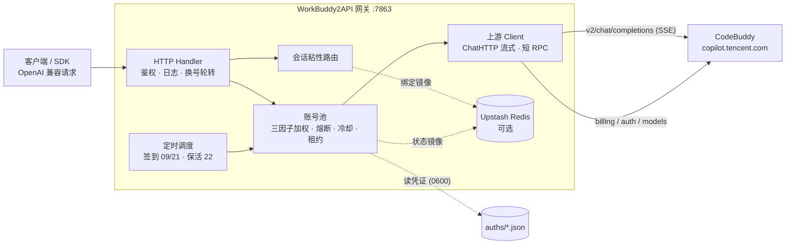

<p align="center">
  
</p>

<h1 align="center">WorkBuddy2API</h1>

<p align="center">
  <b>把腾讯 CodeBuddy 账号变成 OpenAI 兼容 API 的多账号网关</b><br>
  OAuth 登录 · 账号池轮转 · 熔断与冷却 · 会话粘性 · 定时签到保活 · 流式/非流式
</p>

<p align="center">
  
  
  
  
</p>

---

## 📖 项目简介

WorkBuddy2API 是一个自托管的 **OpenAI 兼容反向代理网关**，将腾讯 CodeBuddy（`copilot.tencent.com`）账号包装为统一的 `/v1/chat/completions` 服务。

- 官方不提供 OpenAI 形态的开放 API，本项目通过 **OAuth 设备授权** 获取账号凭证，在网关侧做 token 自动刷新、账号池调度与流量治理；
- 面向 **个人多账号** 场景：多账号共享、单号故障自动换号、冷却/熔断防止雪崩、会话粘性保证多轮上下文不跳号；
- 对客户端只暴露 OpenAI 兼容接口，现有 SDK / 前端 / 工具 **零改造接入**。

> ⚠️ 合规须知：本项目是**非官方**网关，使用 CodeBuddy 账号作为上游，**仅限本人授权账号、本机/私有环境测试**。详细边界见 [安全与合规](#-安全与合规)。

## ✨ 核心能力

| 能力 | 说明 |
|---|---|
| 🔑 **OAuth 一键登录** | `login.sh` 设备授权流程（无 PKCE），自动落盘凭证并重启容器 |
| 🔄 **多账号池** | 三因子加权随机选号（积分比例 ×10 + 闲置补偿 + 成功率 ×3），Top-5 候选 + 防惊群 |
| 🛡️ **熔断与冷却** | 429/404 软冷却、402/余额不足硬冷却至次日 04:00、连续失败指数退避熔断、在途租约限流 |
| 🧲 **会话粘性** | 同一会话（`conversation_id`）尽量绑定同一账号，TTL 滚动续期，失败自动解绑 |
| ⏰ **定时任务** | 每日 09:00 / 21:00 自动签到 + 余额查询解冻；22:00 全账号 token 刷新保活 |
| ⚡ **流式 + 非流式** | 上游 SSE 逐帧规范化透传；出站强制 `stream:true`，非流式由本地聚合为单响应 |
| 🧠 **推理模型兼容** | `reasoning_content` 白名单保留、工具调用（`tool_calls`）按 index 合并、effort 自动降级 |
| 📊 **可观测** | 每请求一行表格日志（TTFB/token 速率/uid）；`/healthz` 可接负载均衡 |
| 💾 **状态持久化** | 池状态本地原子落盘 + Upstash Redis 异步镜像（可选），重启择新恢复 |
| 🗑️ **指纹脱敏** | 出站请求体黑名单指纹字段清洗（可关闭） |

## 🗺️ 架构总览



## 🚀 快速开始

### 环境要求

- **Docker + Docker Compose**（推荐部署方式，镜像内已含 `app` 低权限用户）
- 一个（或多个）已注册的 CodeBuddy 账号，用于 OAuth 登录
- 宿主机 Go ≥ 1.22（仅本地直接编译时需要）

### 1. 克隆并配置

```bash
git clone https://github.com/Sliverkiss/workbuddy2api.git
cd workbuddy2api
cp config.example.json config.json
```

编辑 `config.json`，**至少设置 `api_key`**（`留空 = 不鉴权`，公网部署务必设置）：

```bash
# 用编辑器把 "api_key" 改成你自己的强随机串
```

### 2. 登录添加账号

```bash
./login.sh
# 1) 脚本输出授权 URL
# 2) 浏览器打开完成登录
# 3) 回到终端按 y → 自动签到 → 落盘 auths/workbuddy-<uid>.json → 重启容器
```

多账号只需重复执行；账号池自动发现 `auths/` 下新增凭证文件（容器启动时 `SyncToDir` 对齐）。

### 3. 启动服务

**方式 A：Docker（推荐）**

```bash
docker compose up -d --build
```

**方式 B：Windows 原生运行（不用 Docker）**

**最省事：直接双击项目根目录的 `start.bat`。**

命令行方式：

```powershell
.\run.ps1                                       # 使用 config.json
.\run.ps1 -Config other.json                    # 指定其它配置
```

`start.bat` 只是 `run.ps1` 的一层壳：切到项目目录 → `wb2api.exe` 缺失时自动 `go build` →
前台运行 → 进程退出后保持窗口显示退出码。`Ctrl+C` 停止。
`run.ps1` 在启动失败时会自动诊断端口（是被占用、还是落在系统保留段里），并给出换端口建议。

> `start.bat` 为纯 ASCII 内容 + CRLF 换行（cmd 按 OEM 代码页解析，中文会乱码，故提示语用英文；
> 中文诊断信息由 `run.ps1` 输出，它是 UTF-8 with BOM，在 PowerShell 下显示正常）。

想在后台常驻：

```powershell
Start-Process -FilePath .\wb2api.exe -WindowStyle Hidden   # 启动
Get-Process wb2api | Stop-Process                          # 停止
```

原生运行与 Docker 的差异：

| 项 | Docker | 原生运行 |
|---|---|---|
| 工作目录 | 容器内 `/app` | 必须**项目根目录**（`auths`/`data`/`config.json` 都是相对路径） |
| 时区 | compose 的 `TZ=Asia/Shanghai` | 跟随 Windows 系统时区，无需额外设置 |
| Redis | 同 | 同（未配置 upstash 则纯内存模式） |
| 监听 | `0.0.0.0:7863` | `config.json` 的 `listen` |

> ⚠️ **Windows 端口保留段**：Hyper-V / WSL2 / Docker Desktop 会预留一批 TCP 端口段，落在保留段内的端口**任何程序都绑不上**，报错：
> `bind: An attempt was made to access a socket in a way forbidden by its access permissions`（`WSAEACCES`，`os error 10013`）。
> 查保留段：
>
> ```powershell
> netsh int ipv4 show excludedportrange protocol=tcp
> ```
>
> 本机实测 `7769-7868` 被保留 → 项目默认的 `7863` 正好落在其中，因此本仓库的 `config.json`
> 已改为 `"listen": "127.0.0.1:8787"`（`config.example.json` 仍保留上游默认 `:7863`）。
> **下文所有 `localhost:7863` 的示例，在本机请换成 `8787`。**
> 想局域网/手机访问就把 `listen` 改成 `:8787`（会额外弹一次防火墙授权）。

> 另外：`wb2api.exe` 只在**启动时**读一次 `auths\`，新增账号后需要重启进程才生效
> （`login.ps1` 会自动检测并提示；Docker 模式下它是靠 `docker restart` 解决的）。

### 4. 验证

```bash
# 健康检查（无可用账号时 503）
curl -s http://localhost:7863/healthz

# 模型列表
curl -s http://localhost:7863/v1/models \
  -H "Authorization: Bearer your-api-key"

# 账号状态（汇总 + 每账号详情）
curl -s http://localhost:7863/status \
  -H "Authorization: Bearer your-api-key"

# 流式聊天
curl -sN http://localhost:7863/v1/chat/completions \
  -H "Authorization: Bearer your-api-key" \
  -H "Content-Type: application/json" \
  -d '{"model":"deepseek-v4-flash","messages":[{"role":"user","content":"hi"}],"stream":true}'

# 非流式聊天（本地聚合）
curl -s http://localhost:7863/v1/chat/completions \
  -H "Authorization: Bearer your-api-key" \
  -H "Content-Type: application/json" \
  -d '{"model":"deepseek-v4-flash","messages":[{"role":"user","content":"hi"}],"stream":false}'
```

## ⚙️ 配置说明

完整字段以 [`config.example.json`](config.example.json) 为样例（下表为各字段含义）。

```json
{
  "listen": ":7863",
  "api_key": "your-api-key-here",
  "auth_dir": "./auths",
  "state_file": "./data/state.json",
  "cooldown": { "soft_rate": "60s" },
  "schedule": { "checkin_hours": [9, 21], "keepalive_hours": [22] },
  "upstream": {
    "timeout_seconds": 120,
    "header_timeout_seconds": 120,
    "idle_timeout_seconds": 300
  },
  "features": { "sanitize_blacklist_fingerprints": true },
  "upstash": { "url": "", "token": "" },
  "pool": {
    "max_in_flight": 3,
    "breaker_threshold": 3,
    "breaker_cooldown": "30m",
    "breaker_cooldown_max": "6h",
    "idle_weight_per_hour": 0.5,
    "idle_weight_max": 5.0
  },
  "session_sticky": { "enabled": true, "ttl": "30m", "gc_interval": "5m" }
}
```

### 字段速查

| 字段 | 默认 | 说明 |
|---|---|---|
| `listen` | `:7863` | HTTP 监听地址 |
| `api_key` | 空 | 网关鉴权密钥；**空 = 不鉴权直接放行**（公网必须设置） |
| `auth_dir` | `./auths` | 账号凭证目录 |
| `state_file` | `./data/state.json` | 账号池状态持久化文件 |
| `cooldown.soft_rate` | `60s` | 429/404 软冷却时长 |
| `schedule.checkin_hours` | `[9, 21]` | 每日本地时区整点签到 + 余额查询 |
| `schedule.credit_refresh` | `30m` | 额度刷新间隔（duration）；`0` = 关闭定时刷新，仅留签到与手动刷新。上游 billing 接口对频率敏感，故串行 + 200ms 间隔 |
| `schedule.keepalive_hours` | `[22]` | 每日本地时区整点刷新 token 保活 |
| `upstream.timeout_seconds` | `120` | 短 RPC（刷新/签到/余额/模型）总时长上限 |
| `upstream.header_timeout_seconds` | 回落 `timeout_seconds` | 聊天首字节前（响应头）上限 |
| `upstream.idle_timeout_seconds` | `300` | 聊天流中空闲上限（活跃续命，静默断流） |
| `features.sanitize_blacklist_fingerprints` | `true` | 出站请求体黑名单指纹脱敏 |
| `upstash.url` / `token` | 空 | 空 = 纯内存模式（Noop 降级，功能照常） |
| `pool.max_in_flight` | `3` | 单账号最大在途请求数（`0` = 不限） |
| `pool.breaker_threshold` | `3` | 连续失败触发熔断阈值 |
| `pool.breaker_cooldown` | `30m` | 熔断基础退避时长 |
| `pool.breaker_cooldown_max` | `6h` | 指数退避封顶 |
| `pool.idle_weight_per_hour` | `0.5` | 闲置补偿：每小时未使用 +0.5 权重 |
| `pool.idle_weight_max` | `5.0` | 闲置补偿权重封顶 |
| `session_sticky.enabled` | `true` | 会话粘性路由开关 |
| `session_sticky.ttl` | `30m` | 会话绑定 TTL（滚动续期） |
| `session_sticky.gc_interval` | `5m` | 过期绑定 GC 周期 |

### 上游超时语义（三段各归其位）

| 字段 | 作用对象 | 默认 | 行为 |
|---|---|---|---|
| `timeout_seconds` | 短 RPC（token 刷新 / 签到 / 余额 / 模型列表） | `120` | 总时长硬上限，到期报错走换号/熔断 |
| `header_timeout_seconds` | 聊天 SSE **首字节前** | `120` | 由 `Transport.ResponseHeaderTimeout` 约束；超时 = 换号重发 |
| `idle_timeout_seconds` | 聊天 SSE **流中空闲** | `300` | 活跃吐数据**续命**不掐；静默超时才断流释放租约 |

聊天流（`stream` true/false 均同）**没有总时长上限**：聊天使用 `Timeout=0` 的专用 client，长思考/长输出（如超长 reasoning）不会被 120s 掐断。

### 环境变量覆盖

加载顺序：JSON 文件 → `WB2A_*` 环境变量（变量非空才覆盖）：

`WB2A_LISTEN` · `WB2A_API_KEY` · `WB2A_AUTH_DIR` · `WB2A_STATE_FILE` · `WB2A_SOFT_RATE`（duration） · `WB2A_TIMEOUT_SECONDS` · `WB2A_HEADER_TIMEOUT_SECONDS` · `WB2A_IDLE_TIMEOUT_SECONDS` · `WB2A_SANITIZE_FINGERPRINTS`（bool）

## 🧠 账号池与流量治理

### 账号状态机

每个账号由三个正交维度描述：

| 维度 | 字段 | 说明 |
|---|---|---|
| 健康 | `disabled` / `until` / `breakerUntil` | `healthy = !disabled && !until && !breakerUntil` |
| 并发 | `inFlight` | 在途租约（运行态，不持久化），上限 `max_in_flight` |
| 痕迹 | `inFlightPeak` / `peakAt` | 近 10s 内的在途峰值（运行态，不持久化）：短请求整体落在 GUI 采样间隔内时，瞬时 `inFlight` 读不到，靠峰值呈现"刚忙过" |
| 观测 | `creditsKnown` / 积分变动历史 | `credits` 是否为上游可信值（随 state 落盘）；每次变动追加一条 `data/credit-log.jsonl` 记录（签到 +100、调用消耗、额度刷新），仅观测不参与选号/冷却/熔断决策。GUI「日志」页可按单个账号过滤查看（双击账号行直达） |
| 统计 | `successCount` / `errTotal` / `lastUsed` | 供成功率权重与闲置补偿 |

```text
  Healthy ──429/404 软冷却 / 402 硬冷却 / 5xx 熔断──▶ 冷却·熔断期
     ▲                                                │
     │       到期自动恢复 / 签到余额解冻 / 成功清零     │
     └────────────────────────────────────────────────┘

  Disabled（session 死亡，永久，需人工重新 login.sh）
```

### 错误分类与处置

| 分类 | 触发条件 | 账号处置 | 恢复 |
|---|---|---|---|
| 余额不足 | HTTP 402 / body 含余额关键词 | 硬冷却到**次日 04:00**（本地时区） | 签到（09/21 点）余额恢复自动解冻 |
| 频控 | HTTP 429 | 软冷却 `soft_rate`（60s） | 到期自动恢复 |
| Session 失效 | body 含 `Offline user session not found` / `12153` | **永久禁用** | 人工重新登录 |
| 上游 404 | HTTP 404 | 软冷却（60s） | 到期自动恢复 |
| 服务端错误 | HTTP ≥500 | 喂连续失败计数，达阈值熔断 | 熔断到期 / 成功清零 |
| 客户端错误 | 其余 4xx / 业务 `code≠0` | 不处罚，换号重试 | 即时 |
| 模型级限流 | `code=6004`（"使用量已超出频率限制…切换其他模型"） | **按（账号×模型）冷却**：起步 **10 分钟**，连续撞墙翻倍，**封顶 15 分钟** | **半开自愈**：撞墙 2 分钟后即有 10% 概率被真实请求试探，成功立即恢复；账号有成功请求即清零冷却 |

**模型级限流（6004）为什么按"账号×模型"而不是按账号冷却**：该限制是模型级的，同账号
其他模型实测照常可用；按账号冷却会长时间误伤。也**不采信**报文里的"重置可用"时刻
（实测预报 22:56 实际 02:52 已恢复）。日志形如 `model_rate_limit uid=xxx model=xxx 冷却=10m0s status=429`。

**半开自愈（half-open）**：冷却满 2 分钟（安静期）后，每次选号有 10% 概率把某个
"冷却中但安静期已过"的账号放出去发一次真实请求（优先选冷却剩余最短的）；成功则
立即清除该账号该模型的全部冷却，失败则冷却按退避继续。没有它，上游对某模型的全局
限流会把所有账号先后推进长冷却（实测 20:22 事故：6 账号全部冷却、服务断供 9 分钟，
而上游实际恢复远早于冷却截止）。概率放行也保证不会瞬间把全部冷却账号同时打上游。

**熔断器**：6004 的按模型冷却**不喂**熔断计数（与 429/404/402/5xx 不同）——它是模型级的
暂时限制，账号整体仍健康；喂入会把这些账号错误地熔断掉。

**熔断器**：所有冷却入口（429/404/402）与 5xx 共用唯一连续失败计数器 `fails`；累计达 `breaker_threshold`（默认 3）触发熔断，退避 `breaker_cooldown × 2^retryCount`，封顶 `6h`；成功清零。

### 选号策略

1. 过滤：禁用 / 冷却 / 熔断 / 在途占满账号不参与
2. 取 **Top-5** 候选（按三因子权重降序，积分只是因子之一）
3. 三因子加权随机：
   `weight = credits 比例 ×10 + idleWeight + successRate ×3`
   - `credits 比例` = 该号积分 / 候选集最大积分
   - `idleWeight` = `min(闲置小时 × idle_weight_per_hour, idle_weight_max)`，从未使用给满分
   - `successRate` = `successCount/(successCount+errTotal)`，无记录给中性 1.5
4. 防惊群：跳过 100ms 内刚被选中的账号；全冷却时从非禁用、非余额耗尽的软冷却/熔断账号中选最早到期者顶班

### 会话粘性

同一会话尽量复用同一账号，多轮对话不跳号：

- 会话键提取顺序：`metadata.conversation_id` → `metadata.user_id` → 顶层 `conversation_id`
- TTL 滚动续期（默认 30m），GC 周期 5m；绑定可镜像到 Redis（7 天）防重启丢失
- 请求失败自动解绑；成功后绑定跟随最终成功账号

### 定时任务

| 任务 | 时刻（本地时区） | 行为 |
|---|---|---|
| 签到 | `checkin_hours` 默认 `[9, 21]` 整点 | 签到 + 余额查询；余额恢复则解冻冷却账号 |
| 保活 | `keepalive_hours` 默认 `[22]` 整点 | 全账号刷新 token；session 失效自动禁用 |

容器时区由 `TZ` 控制（compose 默认 `Asia/Shanghai`）。

### 积分变动历史（data/credit-log.jsonl）

每次账号积分发生变动都会**追加**一条记录，用于回答"我的积分怎么少了/多了"：

```json
{"at":"09-11 06:32:31","uid":"2b145025-...","old":2078,"new":2077,"delta":-1,"reason":"自动刷新"}
```

| 字段 | 说明 |
|---|---|
| `at` | 变动时刻 `MM-DD HH:MM:SS`（本地时区，与签到记录同格式） |
| `uid` | 完整账号 UID（存 UID 而非昵称：昵称会变，UID 不变，按 UID 过滤不会因改名而失效） |
| `old` / `new` | 变动前后余额快照 |
| `delta` | `new - old`；首次拿到余额时无参照系，`delta=0` 且带 `first:true` |
| `reason` | 变动来源：`签到` / `签到（今天已签到）` / `自动刷新` / `手动刷新` / `签到（启动补签）` 等 |

**为什么是 JSONL 而不是 JSON 数组**：数组格式每次落盘都要整体重写，代价随历史长度增长。
而积分写入很频繁：实测本地示例数据 3 个账号在 56 分钟内写了 26 条（与 `credit_refresh`
设为 2 分钟一致），即约 90 条/小时。原实现下磁盘上限 2000 条（约 22 小时）、
界面只显示最新 500 条（约 5.5 小时），更早的记录就看不到了。JSONL 只 append 一行，
代价与历史长度无关，因此保留上限提高到 20000 条（约 9 天），界面与落盘同一口径，
且单行损坏只丢那一行（数组格式下一处损坏会丢全部）。

**升级兼容**：旧的 `credit-log.json`（数组格式）在新文件不存在时会被自动读入，
旧文件保留原地不删不改，便于回退与人工核对。

**只观测**：本机制不参与选号、冷却、熔断任何决策；落盘失败也不影响签到/刷新主流程。

## 🔌 API 端点

| 端点 | 鉴权 | 说明 |
|---|---|---|
| `POST /v1/chat/completions` | Bearer（`api_key` 非空时） | OpenAI 兼容补全；流式/非流式；请求体上限 8 MiB |
| `GET /v1/models` | Bearer（`api_key` 非空时） | 模型列表（动态拉取，缓存 1h；失败回落静态表 + 5min 负缓存）**含扩展参数**：思考深度档位、能力标志、消耗倍率 |
| `GET /status` | Bearer（`api_key` 非空时） | 账号状态汇总 + 每账号详情（积分/冷却/熔断/在途/粘性） |
| `GET /healthz` | 无 | 健康检查：有 healthy 且未占满账号返回 200，否则 503 |

> 鉴权规则：仅当 `api_key` 非空才校验 `Authorization: Bearer <api_key>`；**`api_key` 为空时上述端点直接放行**；`/healthz` 恒无鉴权。

### 模型列表的扩展参数

`/v1/models` 除 OpenAI 标准字段（`id`/`object`/`created`/`owned_by`）外，透出上游
`/console/enterprises/personal/models` 提供的扩展信息。标准客户端可忽略这些增量字段：

```json
{
  "id": "glm-5.3",
  "object": "model",
  "context_length": 1000000,
  "max_output_tokens": 48000,
  "name": "GLM-5.3",
  "description": "能力均衡，适合日常使用",
  "reasoning": {
    "default_effort": "high",
    "supported_efforts": ["low", "high", "max"],
    "can_disable_thinking": true,
    "only_reasoning": true
  },
  "capabilities": { "images": true, "tool_calls": true, "reasoning": true },
  "credits_multiplier": 0.79
}
```

| 字段 | 说明 |
|---|---|
| `reasoning.default_effort` | 模型默认思考档（如 `high`） |
| `reasoning.supported_efforts` | **可选**思考档列表；缺失=固定单档模型（上游只给 `default_effort`） |
| `reasoning.can_disable_thinking` | 是否允许关闭思考链 |
| `reasoning.only_reasoning` | 是否只能推理 |
| `capabilities.*` | 图片输入 / 工具调用 / 推理能力 |
| `credits_multiplier` | 消耗倍率（非额度）：账号积分池按此折算各模型可用量 |
| `description` | 中文简介（缺失回落英文） |

> **档位降级**：请求体带 `reasoning_effort` / `reasoningEffort` 时，网关按
> `supported_efforts` 自动降级（请求档不支持则取 ≤ 请求档的最高支持档；全部高于
> 请求档则 floor 到最低档），并在日志打 `reasoning_effort downgraded/floored`。
> 见 [`internal/upstream/payload.go`](internal/upstream/payload.go)。

> **注意**：上游按**账号统一积分池**扣费，**不存在模型级额度**——`credits_multiplier`
> 反映的是消耗速率差异，不是"该模型还剩多少"。同一账号的积分由多个套餐包叠加而成
> （`get-user-resource` 的 `Accounts[]`，每个包有独立到期日）。

### 流式行为细节

- 出站请求强制 `stream:true`；SSE 帧按 OpenAI 规范**白名单重建**（`reasoning_content` 保留、工具调用按 index 合并、未知字段剥离）
- 保证恰好一个 `data: [DONE]`（上游漏发时兜底补写）；空流先写一帧 `error` 再补 `[DONE]`；`error` 帧原样透传

## 📋 请求级日志

每个 `/v1/chat/completions` 请求结束时输出一行表格日志（stdout）：

```text
| #001 | 18:31:31 | deepseek-v4.1-flash | stream | 200 | uid=0851ce35 | effort=low max=16 | ctx=32 | TTFB=801ms | tok=60 | think=16 | 23.5tok/s | total=2.6s |
```

| 字段 | 说明 |
|---|---|
| `#001` | 进程级请求序号 |
| `18:31:31` | 结束时刻 |
| `deepseek-v4.1-flash` | 模型名（超 20 字符截断，带 `…` 提示；此前 11 字符截断会把 flash/pro 等不同模型显示成同一个名字） |
| `stream` / `sync` | 请求模式 |
| `200` | 状态码 |
| `uid=0851ce35` | 账号 UID 前 8 位 |
| `effort=` | **实际发往上游**的思考深度档位（`reasoning_effort` / `reasoningEffort`）；未指定为 `-` |
| `max=` | 客户端指定的输出上限（`max_completion_tokens` 优先，其次 `max_tokens`）；未指定为 `-` |
| `ctx=` | 输入（上下文）token 数，来自末帧 `usage.prompt_tokens`；缺失为 `-` |
| `TTFB` | 流式首帧耗时（非流式为 `-`） |
| `tok` | 输出 token 数，来自末帧 `usage.completion_tokens`；缺失为 `-` |
| `think=` | **思考 token 数**，来自 `usage.completion_tokens_details.reasoning_tokens`（缺失回落 `completion_thinking_tokens`）。它是"档位是否真的生效"的直接证据：`effort=` 只说明请求了什么，`think=` 才说明思考了多少 |
| `tok/s` / `total` | 输出速率 / 总时长 |

### 参数展示的三条规则

1. **`effort=` 记的是实际值，不是客户端原值。** 取值发生在请求体改写【之后】
   （`PrepareBodyOptWithEffortsAndParams` 与出站报文同一次解析），因此日志与上游收到的请求
   永远一致。
2. **档位被降级时显示 `effort=high←max`：** `←` 右侧是客户端原始请求值。例如
   `hy4-preview` 只支持 `high`，请求 `max` 会被改写为 `high`，日志不会静默改变含义。
3. **缺失一律显示 `-`，不显示 `0`。** `ctx=-` / `think=-` 表示上游未上报该字段，
   与"上下文为 0" / "思考为 0"是两回事；`max=-` 表示客户端没传输出上限（由上游默认值兜底）。
   实现上用 `*int`（而非 `int`）区分"缺字段"与"真是 0"。

> **为什么不用 `tok` 直接代表思考量？** 上游的 `completion_tokens` 实测**已包含**思考 token
> （`completion_tokens=16` 时 `reasoning_tokens=16`），所以单看 `tok` 无法区分"思考"与"回答"。
> `think` 单独列出后才能算出回答本身的长度。

**敏感度**：日志不含任何 token 明文（详见[安全与合规](#-安全与合规)）；GUI 模式下日志同时进入
界面面板与 exe 旁的 `gui.log`（CLI 模式仅 stdout）。

## 🛡️ 安全与合规

### 1. 凭据管理（auths）

- **位置**：`./auths`（`auth_dir` 可配），文件名 `workbuddy-<uid>.json`
- **内容**：明文 `accessToken` / `refreshToken` + 账号元信息，结构见下：

```json
{
  "account": { "uid": "…", "enterpriseId": "…", "nickname": "…" },
  "auth": { "accessToken": "明文", "refreshToken": "明文", "expiresAt": 0, "domain": "" }
}
```

- **权限**：容器内以 `app` 用户（uid 10001）运行；token 刷新由 `SaveAtomic` 以 `0600` 原子写回（tmp + rename）；`login.sh` 首次落盘遵循登录 umask，建议手动 `chmod 600 auths/*.json`
- **备份**：备份 `auths/`（凭证）、`data/state.json`（池状态：积分/冷却/计数）与观测记录 `data/checkin-log.json`（签到）、`data/credit-log.jsonl`（积分变动历史，JSONL 每行一条）；配置 Upstash 后状态另镜像至 Redis
- **切勿提交 git**：`.gitignore` 已排除 `auths/`、`data/`、`backups/`、`config.json`、`*.key`、`*.pem`

### 2. 网络暴露与日志敏感度

- 默认监听 `:7863`，compose 暴露 `0.0.0.0:7863`，**无内置 TLS**；公网部署必须设置 `api_key`，建议前置反代/内网
- 请求日志字段：序号/模型/模式/状态码/**uid 前 8 位**/TTFB/token 数——**不含** `accessToken`/`refreshToken`/`api_key` 明文（不读取 `Authorization` 头）
- 日志写 **stdout/stderr**（容器内进入 `docker logs`），代码无任何落盘日志文件

### 3. 上游访问端点清单

| 端点 | 方法 | Host | 用途 |
|---|---|---|---|
| `/v2/chat/completions` | POST | `copilot.tencent.com` | 聊天补全（SSE） |
| `/console/enterprises/personal/models` | GET | 同上 | 动态模型列表 |
| `/v2/plugin/auth/token/refresh` | POST | 同上 | token 刷新 |
| `/v2/billing/meter/daily-checkin` | POST | `www.codebuddy.cn` | 每日签到 |
| `/v2/billing/meter/get-user-resource` | POST | 同上 | 余额查询 |
| `/v2/plugin/auth/state?platform=CLI` | POST | `copilot.tencent.com` | OAuth 取授权 URL |
| `/v2/plugin/auth/token?state=` | GET | 同上 | OAuth 轮询取 token |
| `/v2/plugin/login/account?state=` | GET | 同上 | OAuth 取账号信息 |

> 上述 `/v2/*` 端点是 CodeBuddy 官方 CLI/插件使用的接口，**未见公开 API 文档，属非公开/逆向接口**；本项目不主张任何上游接口的官方授权或稳定性承诺。出站统一携带 `CLI/2.63.2 CodeBuddy/2.63.2` UA；聊天请求带账号头（`X-User-Id` 等），**永不携带 `X-Refresh-Token`**。

### 4. 发布来源与合规边界

- **无预编译 release**：仓库无 Release / tag，产物 = 源码自构建
- 构建命令：`CGO_ENABLED=0 go build -trimpath -ldflags="-s -w" -o wb2api ./cmd/server`（Dockerfile 多阶段：`golang:1.23-alpine` 构建 → `alpine:3.20` 运行）
- 登录/签到/积分工具：`./login.sh` / `./signin.sh` / `./credit.sh`（缺失时自动编译对应 `cmd/*`）
- **无产物校验和**：`go.sum` 仅约束 Go 模块依赖；Docker 镜像由本地 `docker compose build` 生成，未引用第三方镜像
- 上游 CodeBuddy 属腾讯系商业产品，本项目是其**非官方 OpenAI 兼容网关**；使用其账号做 API 网关涉及目标平台服务条款与账号风险，作者不对账号封禁、条款违约或使用结果负责

### 5. 授权使用边界

- 仅限**本人授权账号**、本机/私有环境测试
- 不得共享、转售、违规分发，或用于违反目标平台条款的用途
- 遵守 CodeBuddy 平台服务条款与所在地法律
- 妥善保管 `auths/`（明文凭证）与网关端口

## 🧰 工具脚本

| 脚本 | 用途 |
|---|---|
| `./login.sh` | OAuth 登录 → 落盘 auth → 重启容器 |
| `./signin.sh [auths_dir]` | 批量签到（过期先刷新） |
| `./credit.sh` / `./credit.sh -json` | 积分日报（美化 / 原始 JSON） |

**Windows / PowerShell 等价脚本**（同名 `.ps1`，与 `.sh` 行为一致）：

```powershell
.\login.ps1                          # 对应 ./login.sh
.\signin.ps1                         # 对应 ./signin.sh（位置参数亦可：.\signin.ps1 myauths）
.\signin.ps1 -AuthsDir myauths
.\credit.ps1                         # 对应 ./credit.sh
.\credit.ps1 -Json                   # 对应 ./credit.sh -json
```

- 首次运行会自动 `go build -o <name>.exe ./cmd/...`；`*.exe` 已加入 `.gitignore`
- 脚本以 **UTF-8 with BOM** 保存（Windows PowerShell 5.1 读取中文的必要条件），需 PowerShell 5.1+
- 若脚本来自压缩包而被标记为"来自其他计算机"，需先 `Unblock-File`，或改用 `powershell -ExecutionPolicy Bypass -File .\login.ps1`
- 依赖系统临时目录存放 OAuth state（`os.TempDir()`），不再硬编码 `/tmp`

## 🛠️ 开发

### 本地构建与测试

```bash
go build ./...
go vet ./...
go test ./... -count=20   # 多次运行验证无 flake
go test -race ./... -count=1
gofmt -l .
```

### 目录结构

```
cmd/
  server/    # 主服务（config + main + 路由装配）
  login/     # OAuth 登录工具
  credit/    # 积分查询工具
  signin/    # 批量签到工具
internal/
  auth/      # 凭证解析 + token 刷新 + 原子写回
  pool/      # 账号池（状态机/熔断/租约/加权/持久化）
  scheduler/ # 定时签到 + 保活
  server/    # HTTP handler + 鉴权 + 请求日志
  session/   # 会话粘性路由
  upstream/  # 上游封装（chat/billing/auth/headers/sse/payload/sanitize/idle）
  redisstore/# Upstash 持久化 + Noop 降级
```

## 免责声明

本项目仅供学习和研究使用。使用者需遵守 CodeBuddy 服务条款，自行承担使用风险（包括账号封禁、条款违约等）。作者不对任何因使用本项目产生的直接或间接损失负责。

## License

本仓库未包含 LICENSE 文件。如需使用或再分发，请向仓库所有者确认授权条款。
